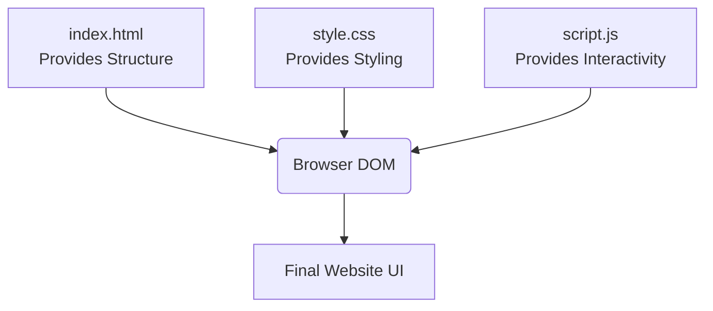
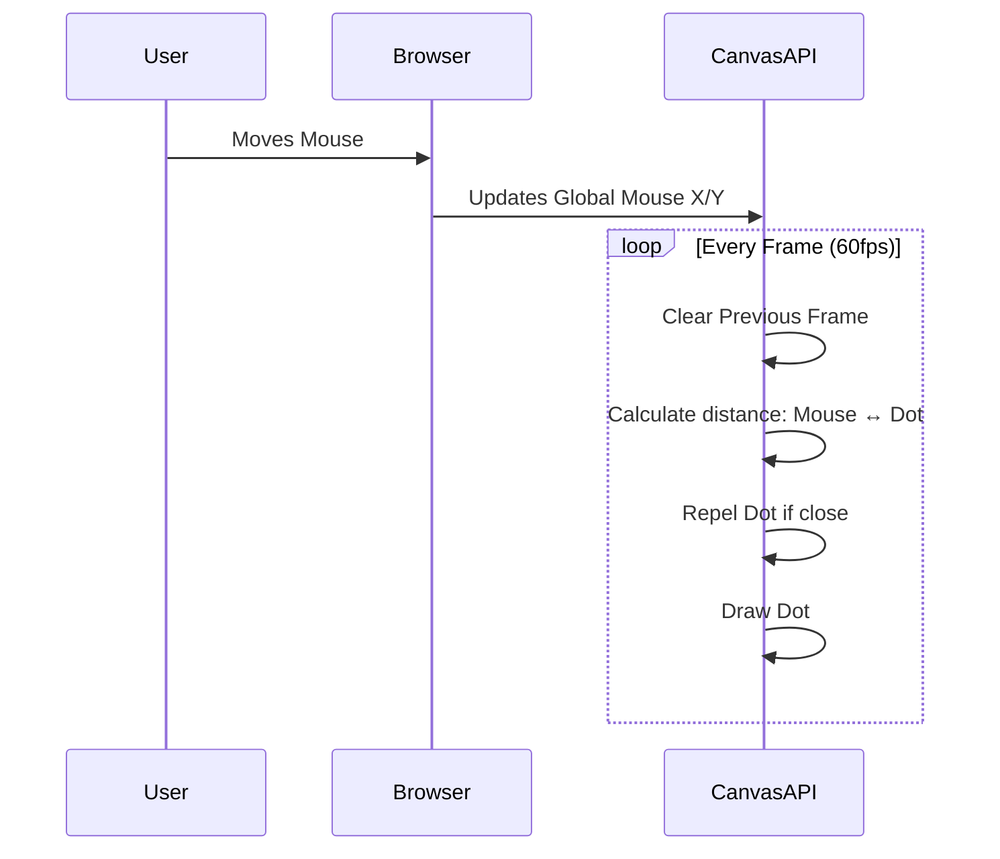

# Code Explanation: Personal Portfolio

This document provides a clear, line-by-line and section-by-section explanation of the code for your portfolio website. It explains **why** certain lines are used and **how** they work together to create the final result.

---

## 1. Overall Architecture

Your website is built using the foundational triad of web development:
- **HTML (`index.html`)**: The skeleton. It defines the structure and the content (text, images, links).
- **CSS (`style.css`)**: The styling. It handles colors, layout, typography, and responsive design (making it look good on mobile).
- **JavaScript (`script.js`)**: The brain/muscle. It handles interactivity, like the dark mode toggle, mobile menu, and dynamic animations.



---

## 2. Exploring `index.html` (The Structure)

HTML uses "tags" to wrap content and tell the browser what that content is.

### The Document Setup (Head)
Lines 1 to 10 in your HTML file set up the document. 

```html
<!DOCTYPE html>
<html lang="en">
<head>
    <meta charset="UTF-8">
    <meta name="viewport" content="width=device-width, initial-scale=1.0">
    <title>Aditya singh | Portfolio</title>
    <link rel="stylesheet" href="style.css">
</head>
```

**Explanation:**
- `<!DOCTYPE html>`: Tells the browser "this is a modern HTML5 document." Without it, browsers might renter the page incorrectly.
- `<meta charset="UTF-8">`: Ensures the browser can read all characters, including emojis and special symbols, without displaying weird glitchy text.
- `<meta name="viewport" content="width=device-width, initial-scale=1.0">`: **Crucial for mobile responsiveness.** It tells mobile browsers to scale the website width to match the screen of the device.
- `<link rel="stylesheet" href="style.css">`: Connects this HTML file to your custom CSS file.

### The Navigation Bar (Header)
```html
<header class="header">
    <nav class="navbar">
        <a href="#" class="logo">Aditya singh</a>
        <ul class="nav-links">
            <li><a href="#home">Home</a></li>
            <li><a href="#about">About</a></li>
        </ul>
        <!-- theme toggle button here -->
    </nav>
</header>
```

**Explanation:**
- `<header>` and `<nav>` are "Semantic Tags". They do the same thing as a `<div>`, but they describe their purpose to search engines (SEO) and screen readers (Accessibility).
- `href="#home"`: This is an internal anchor link. When you click "Home", the browser automatically scrolls down to the element with `id="home"`.

---

## 3. Exploring `style.css` (The Styling)

CSS uses "selectors" to target HTML elements and apply rules to them.

### CSS Variables (The Foundation)
Lines 1 to 23 set the foundation for your colors.

```css
:root {
    --background-color: #0b1622;
    --secondary-bg-color: #121f2d;
    --primary-accent: #ff6b52;
    --text-primary: #ffffff;
    --text-secondary: #a0aec0;
    --transition-speed: 0.3s;
}
```

**Explanation:**
- `:root`: Targets the highest level of the document (the `<html>` element).
- `--primary-accent: #ff6b52;`: This defines a "Variable". **Why?** Imagine you want to change your brand color from Coral (`#ff6b52`) to Blue. Instead of finding and replacing the color in 50 different places, you only change it *once* here, and it updates everywhere instantly!

### Dark / Light Mode System
```css
body.light-mode {
    --background-color: #f7fafc;
    --secondary-bg-color: #ffffff;
    --primary-accent: #ff6b52;
    --text-primary: #1a202c;
}
```

**Explanation:**
- When a user clicks the theme toggle button, our JavaScript adds the class `.light-mode` to the `<body>` tag.
- When this class is present, CSS **overrides** the original dark variables with these light ones. Because we used variables everywhere else in the CSS, the entire website instantly changes color!

### Layout using CSS Grid
This is how we display your skills and projects so beautifully.

```css
.skills-grid {
    display: grid;
    grid-template-columns: repeat(auto-fit, minmax(150px, 1fr));
    gap: 25px;
}
```

**Explanation:**
- `display: grid;`: Activates CSS Grid layout, which is perfect for 2D layouts (rows and columns).
- `repeat(auto-fit, minmax(150px, 1fr))`: This is a massive time-saver! It means "Create as many columns as will fit, but each column must be at least 150px wide. If there's extra space (`1fr`), distribute it evenly." This automatically makes the grid responsive without needing complicated mobile code!

---

## 4. Exploring `script.js` (The Logic)

JavaScript makes everything interactive. It listens for events (like clicks and scrolls) and updates the HTML/CSS in real-time.

```javascript
document.addEventListener('DOMContentLoaded', () => {
    // all code inside here
});
```
- **Why?** It tells JavaScript to "Wait until the HTML is completely loaded before doing anything." If we tried to manipulate an element before it was loaded, the script would crash.


### Dynamic Skills Rendering
Instead of copying and pasting the HTML block for a skill 10 times, we use JavaScript to generate it.

```javascript
const skillsData = [
    { name: 'ReactJS', icon: '<svg>...</svg>' },
    { name: 'NodeJS', icon: '<svg>...</svg>' },
    // more skills
];

const renderSkills = () => {
    const skillsGrid = document.querySelector('.skills-grid');
    skillsGrid.innerHTML = ''; // clear grid

    skillsData.forEach(skill => {
        const skillCard = document.createElement('div');
        skillCard.className = 'skill-card brand-skill reveal';
        skillCard.innerHTML = `
            <div class="skill-icon">${skill.icon}</div>
            <p>${skill.name}</p>
        `;
        skillsGrid.appendChild(skillCard);
    });
};
```

**Explanation:**
1. We store your skills inside an **Array of Objects** (`skillsData`). This acts as our mini-database.
2. We find the destination (`.skills-grid`) using `document.querySelector`.
3. We loop through the array using `.forEach()`. For every skill, we create a new `<div>`, stuff it with the HTML string, and inject it into the grid (`appendChild`). 
4. **Why?** It makes adding a new skill as easy as adding one line to the array, rather than copy-pasting massive SVG code blocks in the HTML file.

### Dark Mode Toggle Logic
```javascript
themeToggle.addEventListener('click', () => {
    body.classList.toggle('light-mode');

    // Save preference
    if (body.classList.contains('light-mode')) {
        localStorage.setItem('theme', 'light');
    } else {
        localStorage.setItem('theme', 'dark');
    }
});
```

**Explanation:**
1. `addEventListener('click', ...)` listens for the user clicking the sun/moon button.
2. `classList.toggle('light-mode')`: Checks if the `<body>` has the light-mode class. If it doesn't, it adds it (turning on light mode). If it does, it removes it (turning on dark mode).
3. `localStorage.setItem`: We save the user's preference directly into their browser's memory. If they close the tab and come back tomorrow, the website will remember their choice!

### The Anti-Gravity Canvas Animation
The dotted animation behind your hero section is built using the HTML5 `<canvas>` API.

```javascript
class Particle {
    constructor() {
        this.x = Math.random() * canvas.width;
        this.y = Math.random() * canvas.height;
        this.baseX = this.x;
        this.baseY = this.y;
    }
    //...
}
```

**Explanation:**
We use Object-Oriented Programming (a `Class`) to define a single `Particle` (dot).
- `constructor()`: When a particle is spawned, it gets a random X and Y coordinate on the screen. It also remembers its starting origin (`baseX` and `baseY`).
- In the `update()` method, we use basic trigonometry (Pythagorean theorem: `a² + b² = c²`) to calculate the exact distance between the user's Mouse (X/Y) and the Particle's (X/Y).
- If that distance is small (the mouse is close), we mathematically push the particle away (`this.x -= force`). If the mouse is far away, the particle slowly drifts back to its `baseX`/`baseY`.



---
**Summary:**
By separating structure (HTML), styling (CSS variables and grids), and dynamic logic (JS functions and canvas), your portfolio is scalable, easy to read, and performant. Every line of code serves a purpose, from ensuring search engine visibility to creating a rich, interactive user experience.
